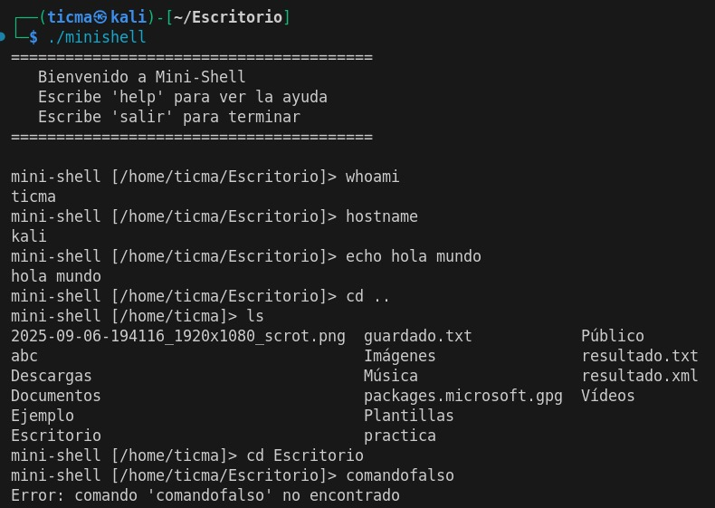
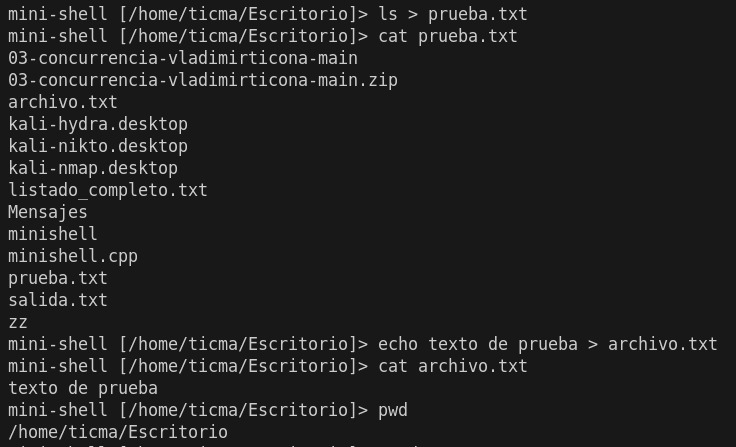
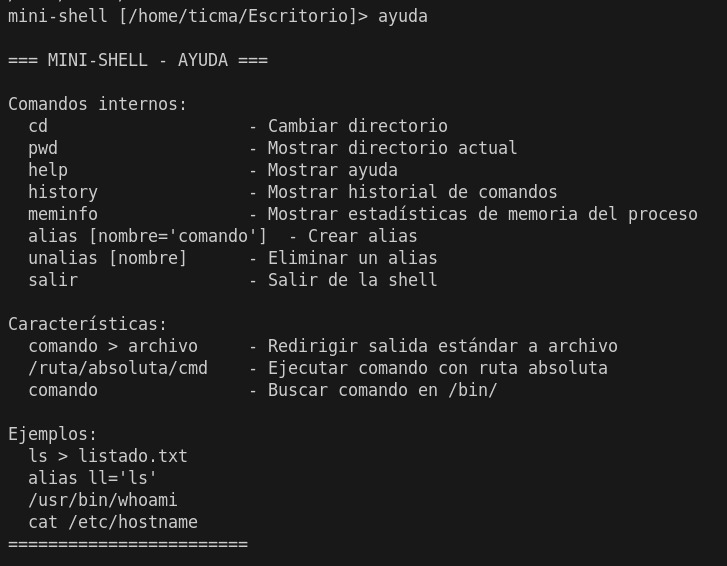
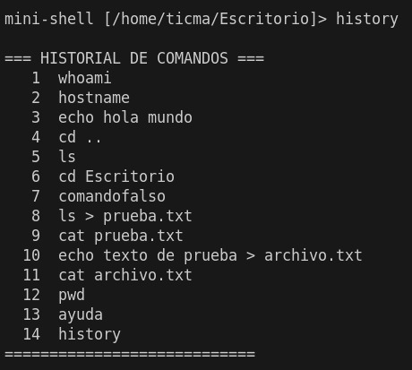
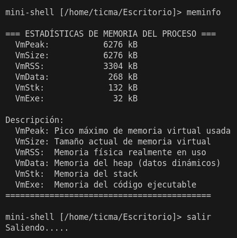

# Mini-Shell
Un intérprete de línea de comandos básico para aprender Sistemas Operativos �

Mini-Shell es un proyecto en C++ desarrollado como herramienta educativa para un curso de Sistemas Operativos. Es un intérprete de comandos sencillo que demuestra conceptos fundamentales como creación y gestión de procesos, comunicación entre procesos y redirección de entrada/salida.

## Características 

| Categoría | Funcionalidad | Estado |
|---|---:|---:|
| Comandos internos | `cd`, `pwd`, `exit`/`salir`, `help`/`ayuda`, `history`, `meminfo`, `alias`, `unalias` | Implementado |
| Comandos externos | Ejecuta binarios mediante ruta absoluta o buscándolos en `/bin/` (no usa la variable PATH) | Parcial (limitado) |
| Redirección I/O | Redirección de salida con `>` (sobrescribe). Append `>>` no implementado | `>`: Implementado; `>>`: No implementado |
| Pipes | Encadenamiento con `|` | No implementado |
| Background | Ejecución en background con `&` y `jobs` | No implementado |

## Requerimientos 

- Sistema operativo: Linux o una capa tipo UNIX (WSL, MinGW o similar en Windows para desarrollo/ejecución).
- Compilador: `g++` o `clang++` (soporta C++11 o superior).

## Compilación y ejecución 

1. Abre una terminal en la carpeta del proyecto (la que contiene `minishell.cpp`).
2. Compila con g++ (ejemplo):

En bash (Linux / WSL):

```bash
g++ minishell.cpp -o minishell
./minishell
```

En PowerShell (Windows) con MinGW/MSYS instalado:

```powershell
g++ minishell.cpp -o minishell.exe
./minishell.exe
```

Si usas WSL puedes compilar y ejecutar como en Linux.


## Casos de prueba y ejemplos de uso 

A continuación se muestra la correspondencia entre las imágenes de ejemplo y los nombres de archivo que propongo. Si tus capturas están en `docs/screenshots/`, renómbralas para que coincidan con estos nombres (o indícame que lo haga yo):

Lista de imágenes de prueba:

- `docs/screenshots/test1.png` — Prueba de Comandos Básicos y Navegación
- `docs/screenshots/test2.png` — Prueba de Redirección de Salida
- `docs/screenshots/test3.png` — Prueba del Comando de Ayuda
- `docs/screenshots/test4.png` — Prueba del Comando de Historial
- `docs/screenshots/test5.png` — Prueba de Información de Memoria

A continuación se incluyen ejemplos que coinciden con esas pruebas.

### 1) Comandos básicos y navegación

Entrada:

```bash
whoami
hostname
echo hola mundo
cd ..
ls
cd Escritorio
```

Salida esperada:

La shell mostrará el usuario actual, el hostname, el texto "hola mundo", listará el contenido del directorio padre y luego navegará al directorio `Escritorio`.

Captura de ejemplo:



---

### 2) Redirección de salida

Entrada:

```bash
ls > prueba.txt
cat prueba.txt
echo texto de prueba > archivo.txt
cat archivo.txt
```

Salida esperada:

Los archivos `prueba.txt` y `archivo.txt` contendrán la salida correspondiente y `cat` mostrará su contenido.

Captura de ejemplo:



---

### 3) Comando de ayuda

Entrada:

```bash
ayuda
help
```

Salida esperada:

La lista de comandos internos y una breve descripción de cada uno.

Captura de ejemplo:



---

### 4) Comando history

Entrada:

```bash
history
```

Salida esperada:

Listado numerado de los comandos ejecutados en la sesión actual.

Captura de ejemplo:



---

### 5) Información de memoria

Entrada:

```bash
meminfo
```

Salida esperada:

Tabla con métricas de memoria (tamaño virtual, RSS, heap/stack, etc.) para el proceso de la shell.

Captura de ejemplo:



---

